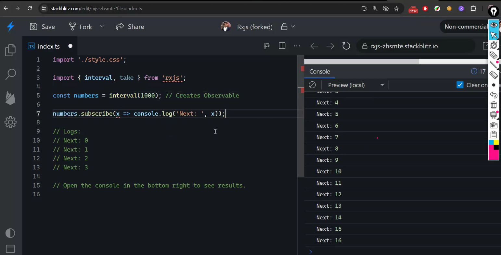
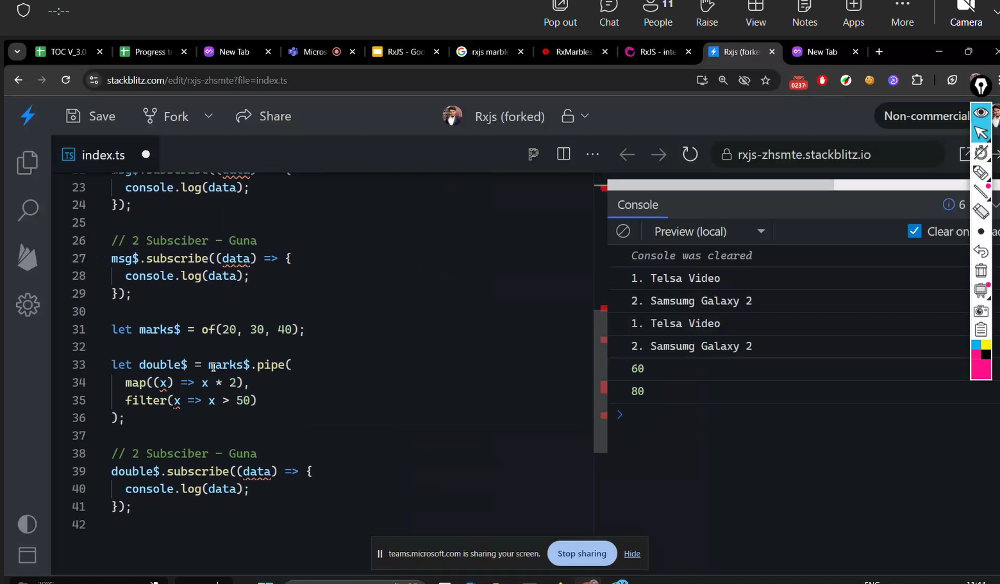

# NOde:

- not a server
- environemtn to run JS
- place to run JS

# why:

- coz browser can't do:
- con't delete
- create
- update
- read

# browsers

- can't acces file system-c,d drive
- can't access hardware details
- can't copy files
- so many viruses in the browser
- love virus- email when we click it will download the virus
- worm virus- duplicates
-

# Usage:

- data streaming
- chat bot
- web scraping

# Node-> window,document--❌❌

- dom not there in node
- doucmnet.--> will not be there in node
- window is also not there-- set tim out and all are there in globalThis obj

# Inbuilt Packages:

> OS
> FS- file system

# Woker thread- call stack

- any thing inside this will block asyn code from the queue

# Node js Bindings

- os operations

# Libuv:

- like jvm in java(andaptor)
- but this will br used by the node js develors
- asynchrronous
- converts commands into taht particular os command

# not there in node

- dom - window

- document

# Express:

- without express also can build server
- express is a frame work on node js like angular
- koa,hapi-- express alternatives

# Render.com- to make node online

- login
- new
- provide github access
- web service
- choose repos correct
-

# imports and exports


## named- recomendded

## default- only one export for file


# Data Types in dynamo db: 3 types

1. scalar- string ,number,boolean- major types
2. Document- subtypes: list(array), map(object)- have key value
3. set-set of strings,set of numbers- no duplicates

```js
genre:
{
    type:"list",
    item:{
        type:"string",
    }
}
```

# Authorization and Authentication

- install bcrypt
- go to npm bcrypt
- then copy the command nd run it

# RXJS:





# Types of operators


- creating
- filtering
- transform
- comination
  

  # Observable:

  
  
  https://stackblitz.com/edit/rxjs-zhsmte?file=index.ts
  




# 16-08

# IIFE:

- immedialty invoked funtion expression
- library authors
- to containein space
- no clash b/w var names

# XHR:

- old version of fetch
  

# structural Vs Nomianal Typings

- TS- structural
- java- nomianl
  > structural means it checks inside even the names are diff they are equal

# bottom types:

- never type- returning an errors, we can type it as never

# Type guards & Narrowing

# Utility Types

- omit
- pick
- partial: means makes the elements optional insed the type
  ex: partial<User> - no need to pass all
  interface User
  {
  id:,
  name:,
  }
- ready only:
- extract
- exclude

# Read Only:

- will not allow to modify

# Extract- like pick

# Exclude- like omit

- pick and omit -> Interface
- Extract & Exclude-> use it on Types

````ts
interface CartItem {
  name: string;
  price: number;
  quantity: number;
}

function calculateTotal(items: CartItem[]): number {
  return items.reduce((total, item) => total + item.price * item.quantity, 0);
}

const cart: CartItem[] = [
  { name: "Apple", price: 1.5, quantity: 4 },
  { name: "Banana", price: 1.0, quantity: 6 },
];

console.log(calculateTotal(cart)); // Outputs the total price

const num: number = 10;

const double: (n: number) => number = (n) => n * 2;

type Cord = {
  x: number;
  y: number;
};

type Point = {
  x: number;
  y: number;
};

const chennai: Cord = { x: 40, y: 20 };

// const hyderabad: Point = { x: 100, y: 120 };

const hyderabad: Point = chennai;

// Typescript - Structure Typings
// Java - Nominal Typings

function validateUserInput(input: string | number): string | never {
  if (typeof input === "string" && input.trim().length > 0) {
    // input.
    return input;
  } else if (typeof input === "number" && input > 0) {
    input.toFixed(2);
    return input.toString();
  }
  throw new Error("Invalid input"); // Function returns never here
}

try {
  validateUserInput(""); // This will throw an error
} catch (error) {
  console.error(error.message); // Handles the error
}

interface CreditCard {
  type: "credit";
  cardNumber: string;
  expiryDate: string;
}

interface PayPal {
  type: "paypal";
  email: string;
}

type PaymentMethod = CreditCard | PayPal;

function processPayment(payment: PaymentMethod) {
  if (payment.type === "credit") {
    // Type narrowed to CreditCard

    // payment.
    console.log(
      `Processing credit card payment for card number ${payment.cardNumber}`
    );
  } else if (payment.type === "paypal") {
    // Type narrowed to PayPal
    // payment.cardNumber
    console.log(`Processing PayPal payment for account ${payment.email}`);
  }
}

const payment: PaymentMethod = {
  type: "credit",
  cardNumber: "1234-5678-9876",
  expiryDate: "12/25",
};
processPayment(payment); // Processes based on type guard

interface User {
  id: number;
  name: string;
  email: string;
  role: string;
}

function updateUser(userId: number, update: Partial<User>): void {
  // Only updates provided fields
  console.log(`Updating user ${userId}`, update);
}

updateUser(1, { name: "John Updated" });

let user1: User = {
  id: 1,
  name: "Nithin",
  email: "nithin@gmail.com",
  role: "Admin",
};

let user2: Partial<User> = {
  name: "Nithin",
};

const user: Readonly<User> = {
  id: 1,
  name: "John",
  email: "john@example.com",
  role: "admin",
};

// user1.name = "Phani" ✅
// user.name = "Jane"; ❌ error

type UserRoles = "admin" | "editor" | "viewer";
type AdminRoles = Extract<UserRoles, "admin">; // Extracts only "admin" // Pick

let role1: UserRoles = "viewer";
let role: AdminRoles = "admin";

type NonViewerRoles = Exclude<UserRoles, "viewer">; // Excludes "viewer" // Omit
let role2: NonViewerRoles = "editor";

// Pick & Omit - interface |  Extract & Exclude - type

### 1. Typing Functions (Practical Example)
### 1. Typing Functions (Practical Example)

Imagine you're building a shopping cart system where you need to calculate the total price of items in the cart.

```typescript
interface CartItem {
  name: string;
  price: number;
  quantity: number;
}

function calculateTotal(items: CartItem[]): number {
  return items.reduce((total, item) => total + item.price * item.quantity, 0);
}

const cart: CartItem[] = [
  { name: "Apple", price: 1.5, quantity: 4 },
  { name: "Banana", price: 1.0, quantity: 6 },
];

console.log(calculateTotal(cart)); // Outputs the total price
````

### 2. Structural vs Nominal Types (Practical Example)

Suppose you're working with different types of financial transactions.

**Structural Typing Example:**

```typescript
interface BankTransaction {
  amount: number;
  date: string;
}

function processTransaction(transaction: BankTransaction) {
  console.log(
    `Processing transaction of $${transaction.amount} on ${transaction.date}`
  );
}

const transaction = { amount: 200, date: "2024-08-16", description: "Salary" };
processTransaction(transaction); // Extra property `description` is ignored, still works
```

**Nominal Typing Example:**
For nominal typing (mimicked), let's say you want to distinguish between different currencies:

```typescript
type USD = { amount: number; currency: "USD" };
type EUR = { amount: number; currency: "EUR" };

function convertToEUR(usd: USD): EUR {
  return { amount: usd.amount * 0.85, currency: "EUR" };
}

const dollars: USD = { amount: 100, currency: "USD" };
const euros: EUR = convertToEUR(dollars); // Conversion based on currency type
```

### 3. Classes & Access Modifier Keywords (Practical Example)

Imagine a library management system where you have classes representing books.

```typescript
class Book {
  private title: string;
  protected author: string;
  public readonly isbn: string;

  constructor(title: string, author: string, isbn: string) {
    this.title = title;
    this.author = author;
    this.isbn = isbn;
  }

  public getBookInfo(): string {
    return `Title: ${this.title}, Author: ${this.author}, ISBN: ${this.isbn}`;
  }
}

class EBook extends Book {
  private fileSize: number;

  constructor(title: string, author: string, isbn: string, fileSize: number) {
    super(title, author, isbn);
    this.fileSize = fileSize;
  }

  public getEBookInfo(): string {
    return `${this.getBookInfo()}, File Size: ${this.fileSize}MB`;
  }
}

const ebook = new EBook("TypeScript Handbook", "John Doe", "123456789", 5);
console.log(ebook.getEBookInfo());
// ebook.title -> Error: Property 'title' is private
```

### 4. Bottom Types: `never` (Practical Example)

Imagine you're writing a function in an API that validates input and throws an error if validation fails.

```typescript
function validateUserInput(input: string | number): string | never {
  if (typeof input === "string" && input.trim().length > 0) {
    return input;
  } else if (typeof input === "number" && input > 0) {
    return input.toString();
  }
  throw new Error("Invalid input"); // Function returns never here
}

try {
  validateUserInput(""); // This will throw an error
} catch (error) {
  console.error(error.message); // Handles the error
}
```

### 5. Type Guards & Narrowing (Practical Example)

Suppose you're building a payment processing system and need to handle different payment methods.

```typescript
interface CreditCard {
  type: "credit";
  cardNumber: string;
  expiryDate: string;
}

interface PayPal {
  type: "paypal";
  email: string;
}

type PaymentMethod = CreditCard | PayPal;

function processPayment(payment: PaymentMethod) {
  if (payment.type === "credit") {
    // Type narrowed to CreditCard
    console.log(
      `Processing credit card payment for card number ${payment.cardNumber}`
    );
  } else if (payment.type === "paypal") {
    // Type narrowed to PayPal
    console.log(`Processing PayPal payment for account ${payment.email}`);
  }
}

const payment: PaymentMethod = {
  type: "credit",
  cardNumber: "1234-5678-9876",
  expiryDate: "12/25",
};
processPayment(payment); // Processes based on type guard
```

### 6. Utility Types (Practical Example)

Imagine you're building a user management system where you need to update, extract, and manipulate user data.

- **Partial:** Updating user profiles where not all fields need to be updated.

```typescript
interface User {
  id: number;
  name: string;
  email: string;
  role: string;
}

function updateUser(userId: number, update: Partial<User>): void {
  // Only updates provided fields
  console.log(`Updating user ${userId}`, update);
}

updateUser(1, { name: "John Updated" });
```

- **Readonly:** Lock down user data after creation.

```typescript
const user: Readonly<User> = {
  id: 1,
  name: "John",
  email: "john@example.com",
  role: "admin",
};

// user.name = "Jane"; -> Error: Cannot assign to 'name' because it is a read-only property
```

- **Extract:** Extract admin users from a list of roles.

```typescript
type UserRoles = "admin" | "editor" | "viewer";
type AdminRoles = Extract<UserRoles, "admin">; // Extracts only "admin"
```

- **Exclude:** Remove unwanted roles from a list.

```typescript
type NonViewerRoles = Exclude<UserRoles, "viewer">; // Excludes "viewer"
```

has context menu

```

```

# Custom Directive

- directive=component-view
  
  

# Angular CLI- command line interface

- to create, add, get elemtns from the command line

---

title: AWS Dynamodb CLI
theme: seriph

# https://sli.dev/custom/highlighters.html

highlighter: shiki

# https://sli.dev/guide/drawing

drawings:
persist: true

# slide transition: https://sli.dev/guide/animations#slide-transitions

transition: slide-left

# enable MDC Syntax: https://sli.dev/guide/syntax#mdc-syntax

mdc: true
background: https://cover.sli.dev
defaults:
layout: center
fonts:

# basically the text

sans: Roboto

# use with `font-serif` css class from UnoCSS

serif: Robot Slab

# for code blocks, inline code, etc.

mono: Fira Code
italic: true

---

# DynamoDB CRUD Operations with AWS CLI

Understanding how to perform basic CRUD operations on DynamoDB using AWS CLI.

---

## Create (Put Item)

```bash
aws dynamodb put-item \
    --table-name author \
    --item '{
        "__edb_e__": {"S": "Author"},
        "__edb_v__": {"S": "1"},
        "bio": {"S": "Tech enthusiast and blogger"},
        "authorId": {"S": "A001"},
        "sk": {"S": "$author_1"},
        "pk": {"S": "$blogservice#authorid_a001"},
        "email": {"S": "john@example.com"},
        "name": {"S": "John Doe"}
    }'
```

This command inserts a new item into the `author` table.

---

## Read (Get Item)

```bash
aws dynamodb get-item \
    --table-name author \
    --key '{
        "pk": {"S": "$blogservice#authorid_a001"},
        "sk": {"S": "$author_1"}
    }'
```

This command retrieves the item with `pk` and `sk` specified from the `author` table.

---

## Update (Update Item)

```bash
aws dynamodb update-item \
    --table-name author \
    --key '{
        "pk": {"S": "$blogservice#authorid_a001"},
        "sk": {"S": "$author_1"}
    }' \
    --update-expression "SET bio = :new_bio" \
    --expression-attribute-values '{
        ":new_bio": {"S": "Updated bio content"}
    }'
```

This command updates the `bio` attribute of the specified item.

---

## Delete (Delete Item)

```bash
aws dynamodb delete-item \
    --table-name author \
    --key '{
        "pk": {"S": "$blogservice#authorid_a001"},
        "sk": {"S": "$author_1"}
    }'
```

This command deletes the specified item from the `author` table.

---

# Thank You!
